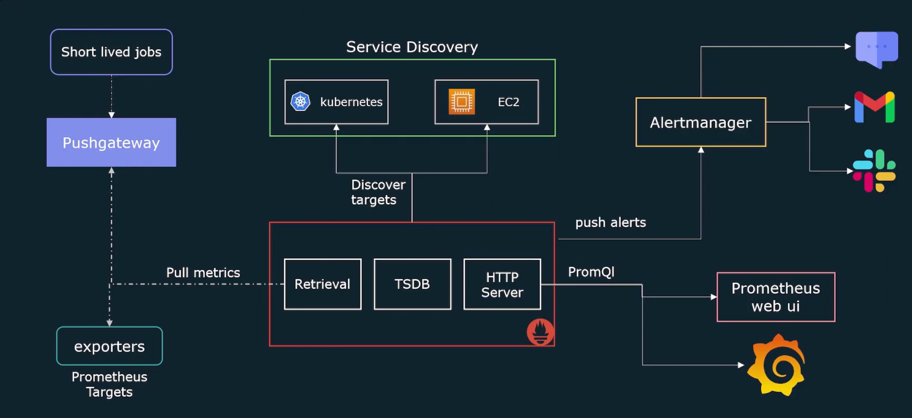

# Basics of Observablity

### Pillers of Observablity

1. Logs
2. Metrics  --> Prometheus only handles metrics
3. Traces


**SLI stands for Service Level Indicator**. It's a way to measure the performance or behavior of a service. Think of it as a metric that tells you how well a service is doing in terms of certain aspects that are important to you.

**SLO stands for Service Level Objective**. It's a target or goal that you set for your service based on the SLIs. It defines the level of performance you want to achieve. So, it's like saying, "I want my service to have this level of performance according to these metrics."

>**Note** In simple terms, SLI tells you how your service is actually performing, while SLO tells you how you want it to perform. The SLIs are the measurements, and the SLOs are the goals.

## Prometheus Architecture
--------------


## Prometheus Installation
---
1. Run the following commands

    ```BASH
    sudo useradd --no-create-home --shell /bin/false prometheus
    
    sudo mkdir /etc/prometheus
    
    sudo mkdir /var/lib/prometheus
    
    sudo chown prometheus:prometheus /etc/prometheus
    
    sudo chown prometheus:prometheus /var/lib/prometheus
    
    wget https://github.com/prometheus/prometheus/releases/download/v2.37.0/prometheus-2.37.0.linux-amd64.tar.gz
    
    tar -xvf prometheus-2.37.0.linux-amd64.tar.gz
    
    sudo cp prometheus /usr/local/bin/
    
    sudo cp promtool /usr/local/bin/
    
    sudo chown prometheus:prometheus /usr/local/bin/prometheus
    
    sudo chown prometheus:prometheus /usr/local/bin/promtool
    
    sudo cp -r consoles /etc/prometheus
    
    sudo cp -r console_libraries /etc/prometheus
    
    sudo chown -R prometheus:prometheus /etc/prometheus/consoles
    
    sudo chown -R prometheus:prometheus /etc/prometheus/console_libraries
    
    sudo cp prometheus.yaml /etc/prometheus/prometheus.yml
    
    sudo chown prometheus:prometheus /etc/prometheus/prometheus.yml
    ```

2. Create a linux systemd service. $PATH: /etc/systemd/system/prometheus.service
    ```BASH
    [Unit]
    Description=Prometheus
    Wants=network online.target
    After=network online.target

    [Service]
    User=prometheus
    Group prometheus
    Type=simple
    ExecStart=/usr/local/bin/prometheus \
        --config.file /etc/prometheus/prometheus.yml
        --storage.tsdb.path /var/lib/prometheus/
        --web.console.templates=/etc/prometheus/consoles
        --web.console.libraries=/etc/prometheus/console_libraries
    [Install]
    WantedBy=multi-user.target
    ```
3. Run the following commands after creating a service
    ```BASH
    sudo systemctl daemon reload
    
    sudo systemctl start prometheus
    
    sudo systemctl enable prometheus
    ```