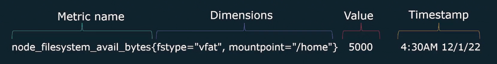

# Basics of Observablity

### Pillers of Observablity

1. Logs
2. Metrics  --> Prometheus only handles metrics
3. Traces




```
SLI stands for Service Level Indicator. It's a way to measure the performance or behavior of a service. Think of it as a metric that tells you how well a service is doing in terms of certain aspects that are important to you.

**SLO stands for Service Level Objective**. It's a target or goal that you set for your service based on the SLIs. It defines the level of performance you want to achieve. So, it's like saying, "I want my service to have this level of performance according to these metrics."

In simple terms, SLI tells you how your service is actually performing, while SLO tells you how you want it to perform. The SLIs are the measurements, and the SLOs are the goals.
```